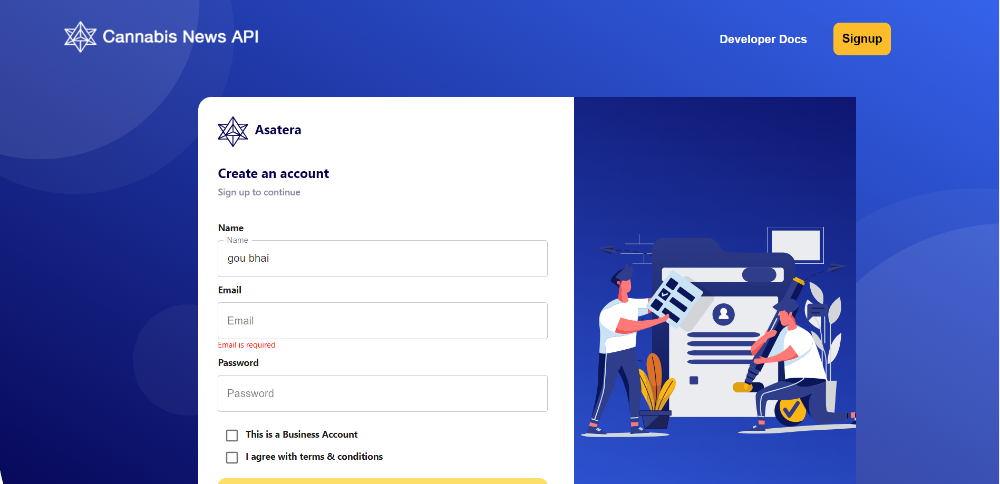

# AWS React Cognito Authentication App

## Overview

This is a sample React application that demonstrates user authentication using AWS Cognito. It provides a basic setup for user registration, login, and account management using AWS Cognito services.

## Prerequisites

Before you begin, ensure you have the following prerequisites:

https://github.com/anishsingh935/AWS-cognito-React/assets/75081988/6972e8c7-df49-4205-a717-fee355e48f19

- AWS Account: You need an AWS account to set up and configure Cognito.
- Node.js and npm: Make sure you have Node.js and npm installed on your local machine.
- AWS CLI: Install and configure the AWS Command Line Interface to interact with AWS resources.

## Getting Started

Follow these steps to set up and run the app:

1. git clone
2. npm install
3. npm run start
